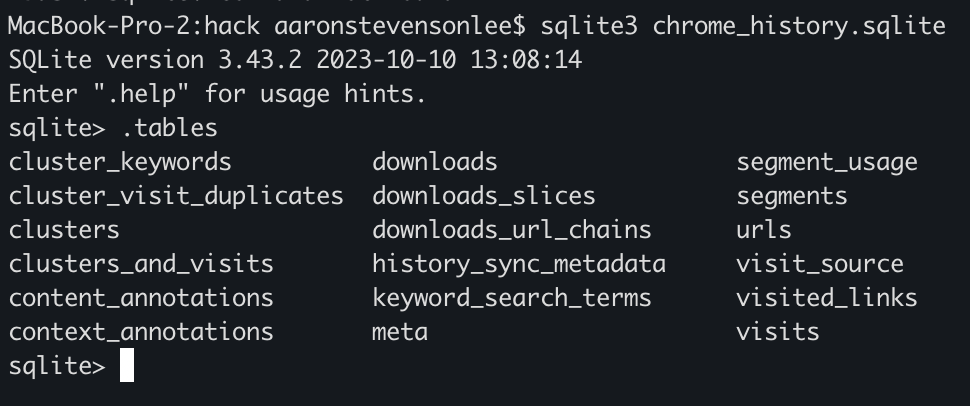

## Pre-check work
1. create hack directory at: `~/hack` <-- central location for all investigation files

## Metamask Deep Dive
### 1. Go to chrome extension
```
cd "~/Library/Application Support/Google/Chrome/Default/Local Extension Settings/nkbihfbeogaeaoehlefnkodbefgpgknn"
```

### 2a. Check and output for leveldb hits

This crawls for the potential hacker addresses and copies the logs into `~/hack/all_metamask_leveldb_hits.txt`:
- 0xeDBA27c121196ac1f3A550B24149C74A3D3af662
- 0x335b6fD14f1EEe027e550D43e9D62058849CfA75
  
```
. grep_leveldb_hits.sh
```

### 2b. Clone Chrome History sqlite

```
. clone_chrome_sqlite.sh
```

verify the sqlite by querying the table
```
sqlite3 ~/hack/chrome_history.sqlite

--------

sqlite> .tables
```



### 3a. Check the text file at `~/hack/all_metamask_leveldb_hits.txt`

### 3b. Check for url visits in the history database, particularly urls and visits during the hack period

```sql
SELECT
  datetime(v.visit_time/1000000-11644473600, 'unixepoch', '+8 hours') AS sgt_time,
  u.url,
  u.title,
  v.transition
FROM visits v
JOIN urls u ON u.id = v.url
WHERE (
    u.url LIKE '%nkbihfbeogaeaoehlefnkodbefgpgknn%'
    OR u.url LIKE '%hyperunit.xyz%'
  )
  AND datetime(v.visit_time/1000000-11644473600, 'unixepoch')
      BETWEEN '2026-05-20 00:00:00' AND '2026-05-22 23:59:59'
ORDER BY v.visit_time ASC;
```